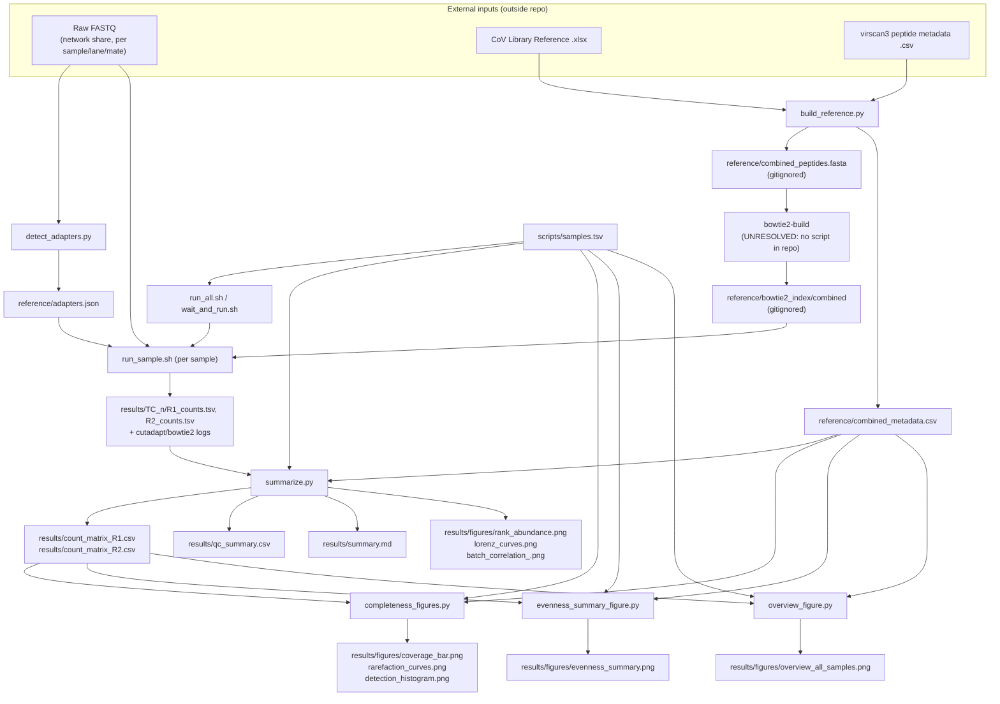

# PhIP-seq Phage Library QC Pipeline

## Overview

This repository is a QC pipeline for two in-house-grown T7 phage-display
libraries ("T7CoV" and "T7 Vir3.2/VirScan3") sequenced **before any
selection** (naive/input pools). It answers a single question per grown
batch: after cloning and growing the designed peptide library, how much of
the designed peptide set survived, and how evenly represented is it
(dropouts, jackpotting/over-representation, batch-to-batch reproducibility)?

Six sequenced batches ("samples") are processed:
- `TC_1`–`TC_4`: T7CoV library (SARS-CoV-2 + related coronavirus peptide
  tiles)
- `TC_5`–`TC_6`: T7 Vir3.2/VirScan3 library (pan-viral peptide tiles)

For each sample, paired-end reads are trimmed to the constant vector
adapter, aligned against a combined reference built from both libraries'
designed peptide sets, and counted per peptide. Counts are then aggregated
into a peptide-by-sample matrix plus QC figures/report (coverage, dropouts,
evenness, cross-library mapping, batch correlation).

As of the current repository state, only the four T7CoV batches (`TC_1`–
`TC_4`) have been processed through to `results/`; the two T7 Vir3.2 batches
(`TC_5`, `TC_6`) have not yet been run (confirmed by the absence of
`results/TC_5*`/`results/TC_6*` in the tree, and by `qc_summary.csv`/
`summary.md` currently only listing `TC_1`–`TC_3`).

This is a set of standalone scripts run locally (no workflow manager, no
job scheduler) — see [Compute requirements](#compute-requirements).

## Repository structure

```
PhIPseq/
├── scripts/
│   ├── build_reference.py         # parses source library references -> combined FASTA + metadata
│   ├── detect_adapters.py         # infers constant adapter sequences -> reference/adapters.json
│   ├── run_sample.sh              # per-sample: cutadapt -> bowtie2 -> per-peptide counts
│   ├── run_all.sh                 # drives run_sample.sh for all/selected samples in samples.tsv
│   ├── wait_and_run.sh            # one-off recovery wrapper around run_all.sh (see script details)
│   ├── summarize.py               # count matrices + qc_summary.csv + core figures + summary.md
│   ├── completeness_figures.py    # coverage / rarefaction / detection-histogram figures
│   ├── evenness_summary_figure.py # per-sample evenness figure
│   ├── overview_figure.py         # combined coverage+evenness overview figure, all samples
│   ├── samples.tsv                # sample sheet: tc_id, library, sample_prefix (all 6 samples)
│   └── samples_preview.tsv        # same format, subset (TC_1-TC_3) — used for partial/early runs
├── reference/
│   ├── adapters.json              # per-library R1/R2 constant adapter sequences (from detect_adapters.py)
│   ├── combined_metadata.csv      # combined peptide metadata (from build_reference.py)
│   ├── combined_peptides.fasta    # combined peptide FASTA (gitignored; regenerated by build_reference.py)
│   └── bowtie2_index/             # bowtie2 index built from combined_peptides.fasta (gitignored)
├── results/
│   ├── TC_1..TC_4/                # per-sample cutadapt/bowtie2 logs + R1_counts.tsv/R2_counts.tsv
│   ├── count_matrix_R1.csv, count_matrix_R2.csv   # peptide x sample count matrices
│   ├── qc_summary.csv             # per-sample QC metrics table
│   ├── summary.md                 # markdown QC report (from summarize.py)
│   ├── figures/                   # PNG figures from summarize.py / completeness_figures.py / etc.
│   ├── coding_plan.md             # human-authored planning notes (project background, design rationale)
│   └── *.run.log, run_*.log       # captured stdout/stderr from pipeline runs
└── .gitignore
```

## Environment & dependencies

No `environment.yml`, `requirements.txt`, `Dockerfile`, or Singularity
definition is present in the repository. Dependencies below are inferred
from imports and shell calls in the scripts; no versions are pinned
anywhere in the repo.

**Command-line tools** (must be on `PATH`, invoked directly from the shell
scripts):
- `cutadapt` — adapter trimming (`run_sample.sh`)
- `bowtie2` — alignment (`run_sample.sh`); `bowtie2-build` is required to
  create the index but is not called from any script in this repo (see
  [Script running order](#script-running-order), step 3 — unresolved/manual)
- `samtools` — read filtering (`samtools view -F 4`) (`run_sample.sh`)
- `gzcat` — gzip decompression (macOS-specific; `run_sample.sh` comments
  note the pipeline is written for macOS, not Linux `zcat`)

**Python** — scripts expect a project-local virtualenv at `PROJECT_DIR/.venv`
(referenced explicitly in `run_sample.sh` as `"$PROJECT_DIR/.venv/bin/python"`;
gitignored, not present in the repo). Third-party packages imported across
the `.py` scripts:
- `pandas` — all of `build_reference.py`, `summarize.py`,
  `completeness_figures.py`, `evenness_summary_figure.py`,
  `overview_figure.py`
- `openpyxl` — not imported directly, but required as the engine for
  `pandas.read_excel()` on the `.xlsx` source reference in
  `build_reference.py`
- `numpy` — `summarize.py`, `completeness_figures.py`,
  `evenness_summary_figure.py`, `overview_figure.py`
- `matplotlib` (backend forced to `Agg`) — same four scripts as `numpy`
- `scipy` (`scipy.special.gammaln`) — `completeness_figures.py` only

`detect_adapters.py` uses only the standard library (`gzip`, `json`,
`collections`).

## Configuration

- **`scripts/samples.tsv`** — tab-separated sample sheet, columns
  `tc_id`, `library` (`CoV` or `Vir3`), `sample_prefix`. Drives which
  samples `run_all.sh` iterates over and which columns appear in the
  aggregation scripts' outputs. Contains all 6 samples.
- **`scripts/samples_preview.tsv`** — same schema, restricted to `TC_1`–
  `TC_3`. Used as an alternate first positional argument to `summarize.py`,
  `completeness_figures.py`, `evenness_summary_figure.py`, and
  `overview_figure.py` for producing outputs from a subset of samples
  (e.g. before a full run has completed). Not read by `run_all.sh`, which
  always reads `samples.tsv`.
- **`reference/adapters.json`** — per-library (`CoV`, `Vir3`) R1/R2 constant
  adapter sequences, generated by `detect_adapters.py` and consumed by
  `run_sample.sh` as the `cutadapt -g` adapter argument.
- **`reference/combined_metadata.csv`** — per-peptide reference table
  (columns below), generated by `build_reference.py`, consumed by
  `summarize.py`, `completeness_figures.py`, `evenness_summary_figure.py`,
  `overview_figure.py` to map each aligned reference ID back to its source
  library/organism/protein/position.
- No YAML/JSON pipeline-wide config or CLI-argument framework (e.g.
  argparse) is used; per-script tunables are Python module-level constants
  or shell variables (see each script's "Key parameters" below).

## Usage

Run from the repository root (`PROJECT_DIR` in the scripts resolves to the
parent of `scripts/`, i.e. this directory).

1. **One-off reference/adapter setup** (only needed if `reference/adapters.json`,
   `reference/combined_metadata.csv`, or the bowtie2 index need to be
   (re)built):
   ```bash
   .venv/bin/python scripts/detect_adapters.py
   .venv/bin/python scripts/build_reference.py
   # then, manually (no script in this repo does this — see note below):
   bowtie2-build reference/combined_peptides.fasta reference/bowtie2_index/combined
   ```
2. **Per-sample trim/align/count**, all samples in `scripts/samples.tsv`,
   one at a time:
   ```bash
   bash scripts/run_all.sh
   ```
   or restrict to specific samples:
   ```bash
   bash scripts/run_all.sh TC_5 TC_6
   ```
3. **Aggregate counts + QC report**:
   ```bash
   .venv/bin/python scripts/summarize.py                 # all samples (scripts/samples.tsv)
   .venv/bin/python scripts/completeness_figures.py
   .venv/bin/python scripts/evenness_summary_figure.py
   .venv/bin/python scripts/overview_figure.py
   ```
   Each of the four aggregation scripts accepts an optional first
   positional argument to point at a different sample sheet (e.g.
   `scripts/samples_preview.tsv` to (re)generate outputs from a subset of
   samples before all 6 have been run).

Note: raw FASTQ input and the two source library reference files (CoV
`.xlsx` and VirScan3 `.csv`) live outside this repository on
lab-internal storage; their exact paths are hardcoded as constants inside
`detect_adapters.py`, `run_sample.sh`, and `build_reference.py` respectively
(see those files for the literal paths) rather than reproduced here.

## Script running order

Confirmed from actual code paths (inputs/outputs, `subprocess`/shell calls),
not from filename order:

1. `detect_adapters.py` and `build_reference.py` — independent of each
   other; both read only external/hardcoded source files, no dependency
   between the two.
2. **Bowtie2 index build — unresolved/external.** No script in this
   repository invokes `bowtie2-build`. `run_sample.sh` requires
   `reference/bowtie2_index/combined` to already exist. This step is only
   described in `results/coding_plan.md` (a human-authored planning note,
   not executable code) as `bowtie2-build` on
   `reference/combined_peptides.fasta`. Treat this as a manual/undocumented
   prerequisite, not a confirmed pipeline step.
3. `run_all.sh` (or `wait_and_run.sh`, a one-off recovery wrapper — see
   its script entry) — calls `run_sample.sh` once per sample line in
   `scripts/samples.tsv`, sequentially (`MAX_PARALLEL=1`).
4. `run_sample.sh` — per sample, requires `reference/adapters.json` (step 1)
   and `reference/bowtie2_index/combined` (step 2) to exist.
5. `summarize.py` — requires `results/<tc_id>/{R1,R2}_counts.tsv` for each
   sample in its sample sheet (from step 4) and `reference/combined_metadata.csv`
   (from step 1).
6. `completeness_figures.py`, `evenness_summary_figure.py`,
   `overview_figure.py` — each requires `results/count_matrix_R1.csv`
   (written by `summarize.py`, step 5) and `reference/combined_metadata.csv`.
   These three do not depend on each other and can run in any order.

## How it fits together / data flow



## Shared inputs/outputs

- **`reference/adapters.json`** — produced by `detect_adapters.py`;
  consumed only by `run_sample.sh`.
- **`reference/combined_metadata.csv`** — produced by `build_reference.py`;
  consumed by `summarize.py`, `completeness_figures.py`,
  `evenness_summary_figure.py`, `overview_figure.py` (all four map
  `ref_id` -> `library`/organism/protein via this file).
- **`reference/combined_peptides.fasta`** (gitignored) — produced by
  `build_reference.py`; consumed only by the unresolved/manual
  `bowtie2-build` step (no script reads it directly).
- **`reference/bowtie2_index/combined`** (gitignored) — produced by the
  unresolved/manual `bowtie2-build` step; consumed only by `run_sample.sh`
  (bowtie2 `-x` argument).
- **`scripts/samples.tsv`** / **`scripts/samples_preview.tsv`** — read by
  `run_all.sh` (always `samples.tsv`) and by `summarize.py`,
  `completeness_figures.py`, `evenness_summary_figure.py`,
  `overview_figure.py` (default `samples.tsv`, overridable via first CLI
  argument).
- **`results/<tc_id>/R1_counts.tsv`, `R2_counts.tsv`** — produced per
  sample by `run_sample.sh`; consumed only by `summarize.py` (R1 and R2
  loaded as separate matrices; R1 is the matrix used by all downstream
  figure scripts).
- **`results/<tc_id>/cutadapt_*.log`, `bowtie2_*.log`** — produced by
  `run_sample.sh`; parsed only by `summarize.py` (`parse_cutadapt_log`,
  `parse_bowtie2_log`) for QC read-count statistics.
- **`results/count_matrix_R1.csv`** — produced by `summarize.py`; consumed
  by `completeness_figures.py`, `evenness_summary_figure.py`,
  `overview_figure.py`.
- **`results/TC_1.run.log`** — produced by `run_all.sh` when launching
  `TC_1`; polled (via `grep`) by `wait_and_run.sh` to detect completion of
  a standalone `TC_1` run.

## Reference data

This pipeline does not use a public reference genome/annotation database;
the "reference" is the combined set of designed phage-display peptide
sequences from two source libraries, external to this repo:

- **T7CoV library** ("CoV" in `library` columns) — SARS-CoV-2 and related
  coronavirus peptide tiles (56mers), sourced from an external
  `CoV Library Reference.xlsx` (path hardcoded in `build_reference.py`,
  not reproduced here). Per-clone barcode ID used as `source_id`; a
  separate `parent_peptide_id` groups synonymous barcode replicates
  (`BC1`/`BC2`/...).
- **T7 Vir3.2 / VirScan3 library** ("Vir3" in `library` columns) — pan-viral
  peptide tiles, sourced from an external `virscan3.peptide.metadata.csv`
  (path hardcoded in `build_reference.py`, not reproduced here), combining
  three source provenances present in that file (`Vir2`, `Vir3`, `IEDB`)
  that share one physical synthesized oligo pool.
- No genome build, gene annotation version, or external sequence database
  (e.g. RefSeq/UniProt release) is referenced anywhere in the scripts;
  `organism`/`protein_name` fields in `reference/combined_metadata.csv` are
  carried through as-is from the two source files without further
  annotation lookup.
- `reference/combined_metadata.csv` columns: `ref_id`, `library`,
  `source_id`, `parent_peptide_id`, `organism`, `protein_name`,
  `peptide_aa`, `start`, `end`, `insert_len`.

## Compute requirements

No SLURM/PBS or other job-scheduler headers are present anywhere in the
repository — all scripts are plain bash/Python intended to run on a local
machine (comments in `run_sample.sh`/`run_all.sh` explicitly reference
macOS, `gzcat`, and a Dropbox-synced project directory over an SMB-mounted
data share).

Confirmed from code:
- `run_sample.sh` uses `bowtie2 -p 4` and `cutadapt -j 2` per mate (R1/R2
  processed sequentially per sample), i.e. up to ~6 threads at peak per
  sample, per the script's own header comment.
- `run_all.sh` sets `MAX_PARALLEL=1` — samples are processed strictly one
  at a time, not in parallel, because (per its comment) the SMB network
  share used for FASTQ input errors under concurrent read streams.
- `run_sample.sh` retries each lane/mate up to 5 times with a 20s backoff
  on failure (transient SMB read errors), and writes large intermediate
  hit-list files to a local `/tmp` path rather than the (Dropbox-synced)
  project directory.

Not confirmed from code (context only, from `results/coding_plan.md`, a
human-authored planning note): the full run across all 6 samples was
anticipated to be a large (~70GB of raw data), long-running background job,
tested first on a truncated read subsample per sample.

## Individual script details

### build_reference.py
- Purpose: parse the two source phage-display library reference files and
  emit one combined peptide FASTA + one combined metadata CSV with
  namespaced IDs.
- Inputs: `CoV Library Reference.xlsx` (external, path hardcoded, not
  reproduced here) — `Nucleotide sequence`, `Barcode ID`, `Peptide ID`,
  `Organsim` [sic], `Protein name`, `Peptide sequence`, `Start position`,
  `End position` columns; `virscan3.peptide.metadata.csv` (external, path
  hardcoded, not reproduced here) — `oligo`, `source`, `id`, `Organism`,
  `Protein.names`, `peptide`, `start`, `end` columns.
- Outputs: `reference/combined_peptides.fasta` (gitignored; downstream
  consumer: the unresolved/manual `bowtie2-build` step only — see
  [Script running order](#script-running-order)); `reference/combined_metadata.csv`
  (downstream consumers: `summarize.py`, `completeness_figures.py`,
  `evenness_summary_figure.py`, `overview_figure.py`).
- Key steps:
  - Load the CoV `.xlsx` via `pandas.read_excel`.
  - For each CoV row, locate the fixed 5'/3' vector anchors in the
    nucleotide sequence and extract the peptide-coding insert between them.
  - Skip CoV rows missing either anchor or with an empty insert (counted
    and logged to stderr).
  - Load the Vir3 `.csv` via `csv.DictReader`.
  - For `source == "Vir2"` rows, extract the insert as the longest
    lowercase run in the (mixed-case-masked) oligo; for `Vir3`/`IEDB` rows,
    extract via fixed 5'/3' anchors (uppercase-only masking convention).
  - Skip Vir3 rows with an insert shorter than 15nt; collapse exact-duplicate
    rows sharing an `id`; disambiguate non-exact `id` collisions with a
    `.dupN` suffix.
  - Concatenate CoV + Vir3 records, de-duplicate by final `ref_id`
    (`CoV|<id>` / `Vir3|<id>`), and write one FASTA record and one metadata
    row per unique `ref_id`.
  - Log parse/skip/duplicate counts to stderr.
- Key parameters: no CLI arguments; all tunables are module-level
  constants — `COV_ANCHOR_5`/`COV_ANCHOR_3` (CoV vector anchor sequences),
  `VIR3_ANCHOR_5`/`VIR3_ANCHOR_3` (Vir3 vector anchor sequences), source
  file paths, output paths.
- Dependencies: `pandas` (+ `openpyxl` engine for `.xlsx`), `csv`, `re`,
  `sys`, `pathlib` (stdlib).

### detect_adapters.py
- Purpose: empirically determine the constant 5' vector adapter sequence
  for R1 and R2 of each library, by consensus base-calling over many reads
  of one representative sample per library.
- Inputs: raw FASTQ for one hardcoded representative sample per library
  (`REPRESENTATIVE_SAMPLES` dict), read from a network share (path
  hardcoded, not reproduced here; external to this repo).
- Outputs: `reference/adapters.json` (downstream consumer: `run_sample.sh`,
  as the `cutadapt -g` adapter for each library/mate).
- Key steps:
  - For each library's representative sample and each mate (R1, R2):
    read up to `N_READS` reads' sequence lines from the gzipped FASTQ.
  - Tally per-position base counts (`Counter`) across those reads, up to
    `WIDTH` positions.
  - At each position, take the most common base and its consensus
    fraction.
  - Find the first position where the consensus fraction drops below
    `DROP_THRESHOLD`; the adapter is the consensus bases up to that
    boundary (interpreted as the constant-adapter/variable-insert
    junction).
  - Print each detected adapter (library, mate, length, sequence) to
    stdout.
  - Write all four adapters (`CoV`/`Vir3` x `R1`/`R2`) to
    `reference/adapters.json`.
- Key parameters: `REPRESENTATIVE_SAMPLES` (hardcoded sample name per
  library, no CLI override); `N_READS = 5000` (reads sampled per
  mate); `WIDTH = 70` (max positions scanned); `DROP_THRESHOLD = 0.8`
  (consensus fraction below which a position is treated as past the
  adapter boundary).
- Dependencies: `gzip`, `json`, `collections`, `pathlib` (stdlib only).

### run_sample.sh
- Purpose: trim, align, and count one sample's reads (both lanes, both
  mates) against the combined bowtie2 index, streaming
  cutadapt -> bowtie2 -> samtools with no intermediate files written to the
  project directory.
- Inputs: raw FASTQ for the given `sample_prefix`, both lanes
  (`L007`, `L008`), both mates (R1, R2), from a network share (path
  hardcoded, not reproduced here); `reference/adapters.json` (from
  `detect_adapters.py`); `reference/bowtie2_index/combined` (from the
  unresolved/manual `bowtie2-build` step).
- Outputs: `results/<tc_id>/R1_counts.tsv`, `R2_counts.tsv` (ref_id →
  read count, tab-separated; downstream consumer: `summarize.py`);
  `results/<tc_id>/cutadapt_{R1,R2}_{L007,L008}.log`,
  `bowtie2_{R1,R2}_{L007,L008}.log` (downstream consumer: `summarize.py`'s
  QC read-count parsing).
- Key steps:
  - Look up the R1/R2 adapter for the given `library` from
    `reference/adapters.json` via an inline Python one-liner.
  - For each mate (R1 then R2) and each lane:
    - Stream-decompress the FASTQ (`cat | gzcat`, to work around an SMB
      close()/EBADF issue noted in comments), optionally truncated to the
      first `subsample_reads` reads via `head`.
    - Pipe through `cutadapt -g <adapter> --discard-untrimmed` (R1 uses
      `bowtie2 --norc`, forward-strand only; R2 uses `--nofw`,
      reverse-strand only) then `bowtie2 -x <index>` then
      `samtools view -F 4 | cut -f3` to get one reference ID per aligned
      read.
    - Retry the whole lane pipeline up to 5 times (20s backoff) on
      failure; exit non-zero after 5 failed attempts.
  - After both lanes for a mate are done, concatenate their per-read
    reference-ID hit lists, `sort | uniq -c`, and write as
    `<mate>_counts.tsv`; remove the temporary per-lane hit-list files.
- Key parameters: positional args `tc_id`, `library` (`CoV`|`Vir3`),
  `sample_prefix`, optional `subsample_reads` (default `0` = full data;
  if >0, only the first N reads per lane/mate are processed, intended for
  a quick sanity check); `LANES=(L007 L008)` (hardcoded); `BOWTIE_THREADS=4`;
  `CUTADAPT_THREADS=2`.
- Dependencies: `cutadapt`, `bowtie2`, `samtools`, `gzcat` (macOS), plus a
  project-local `.venv` Python for the adapter JSON lookup.

### run_all.sh
- Purpose: orchestrate `run_sample.sh` across the sample sheet, one sample
  at a time (or in fixed-size parallel batches, per `MAX_PARALLEL`).
- Inputs: `scripts/samples.tsv` (columns `tc_id`, `library`,
  `sample_prefix`); optional CLI args restricting which `tc_id`s to run.
- Outputs: `results/<tc_id>.run.log` per launched sample (captured
  stdout/stderr from `run_sample.sh`); indirectly, everything
  `run_sample.sh` produces (see above).
- Key steps:
  - Resolve the project directory relative to this script's own location.
  - Read `scripts/samples.tsv`, skipping the header row.
  - For each sample row, skip it unless it matches an optional CLI
    allow-list (`matches_want`); if no CLI args given, run all samples.
  - Launch `run_sample.sh <tc_id> <library> <sample_prefix>` in the
    background, redirecting output to `results/<tc_id>.run.log`.
  - Batch launches in groups of `MAX_PARALLEL`, `wait`-ing for each batch
    before starting the next (comment: avoids relying on bash 4's
    `wait -n`, for macOS/bash 3.2 compatibility).
- Key parameters: `MAX_PARALLEL=1` (hardcoded; sequential execution only,
  because the SMB-mounted FASTQ share errors under concurrent reads, per
  comment); positional CLI args = optional `tc_id` allow-list (default:
  all samples in `samples.tsv`).
- Dependencies: bash only; calls `run_sample.sh`.

### wait_and_run.sh
- Purpose: one-off recovery wrapper — waits for a standalone `TC_1` run
  (started outside `run_all.sh`, per its header comment, "orphaned from an
  earlier driver bug") to finish, then runs the remaining samples strictly
  sequentially via `run_all.sh`.
- Inputs: `results/TC_1.run.log` (polled for a `"[TC_1] done."` marker
  line, which `run_sample.sh` prints on success).
- Outputs: none directly; triggers `run_all.sh TC_2 TC_3 TC_4 TC_5 TC_6`,
  which produces the same outputs as any other `run_all.sh` invocation.
- Key steps:
  - Poll `results/TC_1.run.log` every 30s for the `"[TC_1] done."` marker.
  - If a matching `run_sample.sh TC_1` process is no longer running but
    the marker is absent, warn (possible crash) and stop polling.
  - Once `TC_1` is confirmed done, invoke
    `run_all.sh TC_2 TC_3 TC_4 TC_5 TC_6`.
- Key parameters: none (no CLI args; sample list `TC_2`..`TC_6` is
  hardcoded).
- Dependencies: bash only (`grep`, `pgrep`); calls `run_all.sh`. This
  script encodes a specific historical recovery scenario (an already-running,
  externally-launched `TC_1` job) rather than a general-purpose entry
  point — `run_all.sh` alone is sufficient for a normal run.

### summarize.py
- Purpose: aggregate per-sample per-peptide counts into count matrices and
  produce the core QC report (coverage, dropouts, evenness, cross-library
  mapping, batch reproducibility) as CSVs, PNG figures, and a markdown
  summary.
- Inputs: `scripts/samples.tsv` (or path given as first CLI arg, e.g.
  `samples_preview.tsv`); `reference/combined_metadata.csv` (from
  `build_reference.py`); `results/<tc_id>/{R1,R2}_counts.tsv` and
  `results/<tc_id>/{cutadapt,bowtie2}_{R1,R2}_{L007,L008}.log` per sample
  (from `run_sample.sh`).
- Outputs: `results/count_matrix_R1.csv`, `results/count_matrix_R2.csv`
  (downstream consumers: `completeness_figures.py`,
  `evenness_summary_figure.py`, `overview_figure.py` — R1 matrix only);
  `results/qc_summary.csv`; `results/figures/rank_abundance.png`,
  `lorenz_curves.png`, `batch_correlation_<library>.png` (one per
  library); `results/summary.md`.
- Key steps:
  - Load the sample sheet and reference metadata.
  - Build an R1 and an R2 peptide x sample count matrix from each sample's
    counts TSVs (missing entries filled with 0).
  - Parse cutadapt/bowtie2 logs per sample/mate/lane to compute raw read
    count, trim rate, mapping rate, multimapping rate (summed across
    lanes).
  - For each sample: compute reads mapping to its own vs. the other
    library's references (contamination/mislabelling check), designed
    library size, number/percent of peptides detected, dropout count,
    median count among detected peptides, and a Gini coefficient of
    per-peptide representation (own library only); write as one row of
    `qc_summary.csv`.
  - Plot log-log rank-abundance curves (one line per sample, own-library
    peptides only).
  - Plot Lorenz curves (evenness) per sample against the line of perfect
    evenness.
  - Per library, plot a Pearson-correlation heatmap of log1p(R1 counts)
    across that library's samples (batch reproducibility).
  - Assemble `summary.md`: the QC table plus embedded links to the three
    figure sets above.
- Key parameters: optional CLI arg = path to sample sheet (default
  `scripts/samples.tsv`); `LANES = ["L007", "L008"]` (hardcoded, must match
  `run_sample.sh`'s lane list).
- Dependencies: `pandas`, `numpy`, `matplotlib` (`Agg` backend).

### completeness_figures.py
- Purpose: produce plainer, completeness-focused figures (coverage,
  sequencing-depth rarefaction, per-peptide detection histogram)
  complementing `summarize.py`'s rank-abundance/Lorenz plots.
- Inputs: `scripts/samples.tsv` (or path given as first CLI arg);
  `reference/combined_metadata.csv`; `results/count_matrix_R1.csv` (from
  `summarize.py`).
- Outputs: `results/figures/coverage_bar.png`, `rarefaction_curves.png`,
  `detection_histogram.png`. No script reads these three PNGs downstream
  (terminal outputs, for human review / `results/summary.md` is not
  updated to embed them — confirmed: `summarize.py` only embeds its own
  three figures).
- Key steps:
  - Load sample sheet, reference metadata, and the R1 count matrix.
  - Coverage bar chart: for each sample, % of its own designed library
    detected (>=1 read), annotated with `detected/total` counts.
  - Rarefaction curves: for each sample, compute the exact expected number
    of unique peptides detected at a log-spaced range of subsampled read
    depths (Hurlbert 1971 formula, computed via `gammaln` for numerical
    stability), plotted against a horizontal line at the full designed
    library size.
  - Detection histogram: per sample, one subplot with an explicit
    "never detected" bar plus a log-spaced histogram of per-peptide read
    counts among detected peptides.
- Key parameters: optional CLI arg = path to sample sheet (default
  `scripts/samples.tsv`); no other tunables exposed (rarefaction depth
  range is computed from each sample's own total read count).
- Dependencies: `pandas`, `numpy`, `matplotlib` (`Agg`), `scipy.special.gammaln`.

### evenness_summary_figure.py
- Purpose: one figure summarizing per-sample library evenness (10th-90th
  percentile "typical range" of per-peptide counts, median, and explicit
  near-dropout outliers).
- Inputs: `scripts/samples.tsv` (or path given as first CLI arg);
  `reference/combined_metadata.csv`; `results/count_matrix_R1.csv`.
- Outputs: `results/figures/evenness_summary.png` (terminal output; not
  embedded in `results/summary.md`).
- Key steps:
  - Load sample sheet, reference metadata, and the R1 count matrix.
  - For each sample, restrict to its own library's detected peptides.
  - Plot the P10-P90 range as a vertical bar and the median as a marker,
    on a log-scaled y-axis.
  - Mark peptides at or below `OUTLIER_THRESHOLD` reads as individual
    "near-dropout" markers rather than folding them into a min/max ratio.
  - Label each sample's x-tick with counts of near-dropout and fully
    missing (zero-read) peptides.
- Key parameters: optional CLI arg = path to sample sheet (default
  `scripts/samples.tsv`); `OUTLIER_THRESHOLD = 10` (reads; peptides at or
  below this are called out individually).
- Dependencies: `pandas`, `numpy`, `matplotlib` (`Agg`).

### overview_figure.py
- Purpose: one combined figure comparing all samples' coverage and
  evenness side by side, colored by library, for an at-a-glance
  cross-sample/cross-library comparison.
- Inputs: `scripts/samples.tsv` (or path given as first CLI arg, intended
  to be run with the full sample sheet once all 6 samples are processed,
  per the script's own module docstring); `reference/combined_metadata.csv`;
  `results/count_matrix_R1.csv`.
- Outputs: `results/figures/overview_all_samples.png` (terminal output;
  not embedded in `results/summary.md`).
- Key steps:
  - Load sample sheet, reference metadata, and the R1 count matrix.
  - For each sample: compute % of own-library peptides detected and plot
    as a bar (left panel), colored by library.
  - For each sample: compute the P10-P90 typical range + median of
    detected-peptide counts and plot (right panel), colored by library,
    marking near-dropout outliers (`OUTLIER_THRESHOLD`).
  - Annotate x-tick labels with near-dropout/missing counts per sample.
- Key parameters: optional CLI arg = path to sample sheet (default
  `scripts/samples.tsv`); `OUTLIER_THRESHOLD = 10` (reads);
  `LIBRARY_COLORS = {"CoV": "tab:blue", "Vir3": "tab:orange"}` (colors for
  any other library value fall back to gray).
- Dependencies: `pandas`, `numpy`, `matplotlib` (`Agg`).
