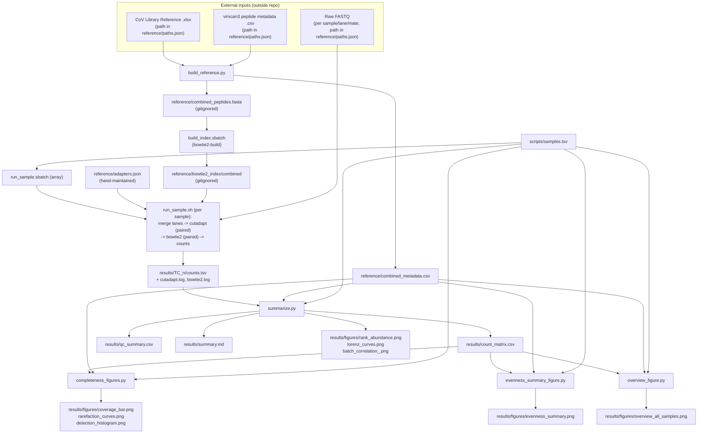

# PhIP-seq Phage Library QC Pipeline

## Overview

This repository is a QC pipeline for two in-house-grown T7 phage-display
libraries ("T7CoV" and "T7 Vir3.2/VirScan3") sequenced **before any
selection** (naive/input pools). It answers a single question per grown
batch: after cloning and growing the designed peptide library, how much of
the designed peptide set survived, and how evenly represented is it
(dropouts, jackpotting/over-representation, batch-to-batch reproducibility)?

Six sequenced batches ("samples") are processed:
- `TC_1`–`TC_4`: T7CoV library (SARS-CoV-2 + related coronavirus peptide
  tiles)
- `TC_5`–`TC_6`: T7 Vir3.2/VirScan3 library (pan-viral peptide tiles)

For each sample, paired-end reads (both sequencing lanes merged first) are
trimmed to the constant vector adapter and aligned as read pairs against a
combined reference built from both libraries' designed peptide sets, then
counted per peptide. Counts are then aggregated into a peptide-by-sample
matrix plus QC figures/report (coverage, dropouts, evenness, cross-library
mapping, batch correlation).

This pipeline was migrated from a local, macOS-only, single-end-per-mate
design to a SLURM-scheduled HPC deployment; see
[slurm_plan.md](slurm_plan.md) for the full design rationale (lane merging,
paired-end alignment, config consolidation, retired scripts, resource
requests) behind the current script behavior described below.

**Results in this repository predate the migration.** `results/` currently
holds output from the old single-end, per-lane pipeline (e.g.
`R1_counts.tsv`/`R2_counts.tsv`, `count_matrix_R1.csv`/`count_matrix_R2.csv`)
for `TC_1`–`TC_4` only. That output does not match the current scripts'
paired-end output shape (`counts.tsv`, `count_matrix.csv` — see
[Script running order](#script-running-order)) and needs to be regenerated
from scratch once the real HPC input paths (see
[Configuration](#configuration)) are filled in and the pipeline is rerun.

## Repository structure

```
PhIPseq/
├── environment.yml                # conda env spec (Python packages only)
├── slurm_plan.md                  # SLURM/HPC migration design notes
├── scripts/
│   ├── build_reference.py         # parses source library references -> combined FASTA + metadata
│   ├── setup_env.sh               # builds/updates the "phipseq" conda env from environment.yml
│   ├── run_sample.sh              # per-sample: merge lanes -> cutadapt (paired) -> bowtie2 (paired) -> counts
│   ├── run_sample.sbatch          # SLURM array job wrapping run_sample.sh, one task per sample
│   ├── build_index.sbatch         # SLURM job: bowtie2-build the combined index
│   ├── summarize.sbatch           # SLURM job: summarize.py + the three figure scripts
│   ├── summarize.py               # count matrix + qc_summary.csv + core figures + summary.md
│   ├── completeness_figures.py    # coverage / rarefaction / detection-histogram figures
│   ├── evenness_summary_figure.py # per-sample evenness figure
│   ├── overview_figure.py         # combined coverage+evenness overview figure, all samples
│   ├── samples.tsv                # sample sheet: tc_id, library, sample_prefix (all 6 samples)
│   └── samples_preview.tsv        # same format, subset (TC_1-TC_3) — used for partial/early runs
├── reference/
│   ├── paths.json                 # external file locations (FASTQ dir, source references) -- placeholders
│   ├── run_params.json            # LANES, BOWTIE_THREADS, CUTADAPT_THREADS
│   ├── build_reference_params.json# vector anchor sequences, minimum Vir3 insert length
│   ├── figure_params.json         # OUTLIER_THRESHOLD, LIBRARY_COLORS
│   ├── hpc_modules.json           # pinned cutadapt/bowtie2/samtools HPC module versions
│   ├── adapters.json              # per-library R1/R2 constant adapter sequences (hand-maintained)
│   ├── combined_metadata.csv      # combined peptide metadata (from build_reference.py)
│   ├── combined_peptides.fasta    # combined peptide FASTA (gitignored; regenerated by build_reference.py)
│   └── bowtie2_index/             # bowtie2 index built from combined_peptides.fasta (gitignored)
├── results/
│   ├── TC_1..TC_4/                # per-sample logs + counts, from the pre-migration pipeline (see note above)
│   ├── count_matrix_R1.csv, count_matrix_R2.csv   # pre-migration output; superseded by count_matrix.csv
│   ├── qc_summary.csv             # pre-migration output; schema has since changed (see summarize.py)
│   ├── summary.md                 # pre-migration markdown QC report
│   ├── figures/                   # PNG figures from the pre-migration run
│   ├── coding_plan.md             # human-authored planning notes (project background, design rationale)
│   └── *.run.log, run_*.log       # captured stdout/stderr from pre-migration pipeline runs
└── .gitignore
```

## Environment & dependencies

**Python** — `environment.yml` at the repo root defines a conda env named
`phipseq` (build/update it with `scripts/setup_env.sh`):
- `python` (unpinned — always resolves the current stable conda-forge
  release)
- `pandas>=2.2`, `numpy>=2.1`, `matplotlib>=3.9`, `scipy>=1.14`,
  `openpyxl>=3.1` (the last is pandas's `.xlsx` engine for
  `build_reference.py`)

These floors are recommended current-stable versions, not confirmed against
what the pre-migration `results/` were generated with (no version pins
existed anywhere in the repo before this migration).

**Command-line tools** — provided by the HPC's module system, not conda;
exact versions are pinned in `reference/hpc_modules.json` and loaded via
`module load` at the top of every `.sbatch` script:
- `cutadapt` (`cutadapt/4.2-GCCcore-11.3.0`) — paired-mode adapter trimming
  (`run_sample.sh`)
- `bowtie2` (`Bowtie2/2.5.4-GCC-14.2.0`) — paired-end alignment
  (`run_sample.sh`); `bowtie2-build` (same module) builds the index
  (`build_index.sbatch`)
- `samtools` (`SAMtools/1.22.1-GCC-14.2.0`) — read filtering/counting
  (`run_sample.sh`)

No `.venv` is used anymore — `run_sample.sh`'s config-loading step needs
only a `python3` with the standard library `json` module on `PATH` (the
activated `phipseq` conda env satisfies this).

## Configuration

Paths, tunables, and library-design constants that used to be hardcoded
Python/shell constants now live in JSON under `reference/`:

- **`reference/paths.json`** — FASTQ directory (`run_sample.sh`) and the two
  source reference files (`build_reference.py`). **Ships with placeholder
  values** — the real HPC paths need to be filled in before the pipeline can
  actually run (see [Overview](#overview)).
- **`reference/run_params.json`** — `lanes` (`["L007", "L008"]`),
  `bowtie_threads`, `cutadapt_threads`. (There is no `max_parallel`/retry
  config — SLURM's own array scheduling and job-failure handling took over
  both roles; see [slurm_plan.md](slurm_plan.md).)
- **`reference/build_reference_params.json`** — CoV/Vir3 vector anchor
  sequences and the minimum Vir3 insert length, consumed by
  `build_reference.py`.
- **`reference/figure_params.json`** — `outlier_threshold` and
  `library_colors`, consumed by `evenness_summary_figure.py` and
  `overview_figure.py` (deduplicated out of both scripts into one file).
- **`reference/hpc_modules.json`** — exact `cutadapt`/`bowtie2`/`samtools`
  module versions; the single source of truth every `.sbatch` script's
  `module load` line should match.
- **`reference/adapters.json`** — per-library (`CoV`, `Vir3`) R1/R2 constant
  adapter sequences, consumed by `run_sample.sh` as the `cutadapt -g`/`-G`
  arguments. **Hand-maintained** — there is no script that (re)derives these
  anymore.
- **`scripts/samples.tsv`** — tab-separated sample sheet, columns `tc_id`,
  `library` (`CoV` or `Vir3`), `sample_prefix`. Drives `run_sample.sbatch`'s
  array-task-to-sample lookup and which columns appear in the aggregation
  scripts' outputs.
- **`scripts/samples_preview.tsv`** — same schema, restricted to `TC_1`–
  `TC_3`. Usable as an alternate first positional argument to
  `summarize.py`, `completeness_figures.py`, `evenness_summary_figure.py`,
  and `overview_figure.py` for producing outputs from a subset of samples.
  Not read by `run_sample.sbatch`, which always uses
  `samples.tsv`.

## Usage

Run from the repository root (`PROJECT_DIR` in the scripts resolves to the
parent of `scripts/`).

1. **Build the conda env** (once, or whenever `environment.yml` changes):
   ```bash
   bash scripts/setup_env.sh
   ```
2. **Fill in real paths** in `reference/paths.json` (FASTQ directory, CoV
   `.xlsx`/Vir3 `.csv` source files) — these ship as placeholders.
3. **Build the combined reference**:
   ```bash
   conda activate phipseq
   python scripts/build_reference.py
   ```
   → `reference/combined_peptides.fasta`, `reference/combined_metadata.csv`
4. **Build the bowtie2 index**:
   ```bash
   sbatch scripts/build_index.sbatch
   ```
   → `reference/bowtie2_index/combined`
5. **Confirm `reference/adapters.json`** has correct R1/R2 adapters for both
   libraries (hand-maintained, no script generates it).
6. **Trim/align/count all samples** (SLURM array job, one task per row of
   `scripts/samples.tsv`):
   ```bash
   sbatch scripts/run_sample.sbatch
   ```
   For local/dev use without SLURM, `run_sample.sh` can be invoked directly
   per sample instead (requires `cutadapt`/`bowtie2`/`samtools` on `PATH`
   and the `phipseq` conda env activated) — there is no batch driver for
   this anymore, so each sample needs its own invocation:
   ```bash
   bash scripts/run_sample.sh TC_1 CoV CAY9116A7_S70
   ```
7. **Aggregate counts + QC report**, once all samples have finished
   (submit with a dependency on the array job's job ID):
   ```bash
   sbatch --dependency=afterok:<run_sample_job_id> scripts/summarize.sbatch
   ```
   which runs, in order: `summarize.py`, `completeness_figures.py`,
   `evenness_summary_figure.py`, `overview_figure.py` — the latter three
   accept an optional first positional argument to point at a different
   sample sheet (e.g. `scripts/samples_preview.tsv`).

Raw FASTQ input and the two source library reference files (CoV `.xlsx` and
VirScan3 `.csv`) live outside this repository on lab-internal storage; their
paths are configured in `reference/paths.json` (currently placeholders, not
reproduced here).

## Script running order

Confirmed from actual code paths (inputs/outputs, `subprocess`/shell calls),
not from filename order:

1. `build_reference.py` — reads only external source files (per
   `reference/paths.json`); independent of every other step.
2. `build_index.sbatch` (`bowtie2-build`) — requires
   `reference/combined_peptides.fasta` from step 1.
3. `reference/adapters.json` — hand-maintained, no script dependency.
4. `run_sample.sbatch` (array job) — each task calls `run_sample.sh` once
   per sample row of `scripts/samples.tsv`; requires
   `reference/adapters.json` (step 3) and `reference/bowtie2_index/combined`
   (step 2) to exist. Samples are independent of each other, and SLURM's
   array scheduling runs them unthrottled/concurrently.
5. `summarize.py` — requires `results/<tc_id>/counts.tsv`,
   `results/<tc_id>/cutadapt.log`, `results/<tc_id>/bowtie2.log` for every
   sample in its sample sheet (from step 4), and
   `reference/combined_metadata.csv` (from step 1).
6. `completeness_figures.py`, `evenness_summary_figure.py`,
   `overview_figure.py` — each requires `results/count_matrix.csv` (written
   by `summarize.py`, step 5) and `reference/combined_metadata.csv`. These
   three do not depend on each other and can run in any order (bundled
   sequentially in `summarize.sbatch` for simplicity).

## How it fits together / data flow



## Shared inputs/outputs

- **`reference/adapters.json`** — hand-maintained; consumed only by
  `run_sample.sh` (paired `cutadapt -g`/`-G` arguments).
- **`reference/combined_metadata.csv`** — produced by `build_reference.py`;
  consumed by `summarize.py`, `completeness_figures.py`,
  `evenness_summary_figure.py`, `overview_figure.py` (all four map `ref_id`
  -> `library`/organism/protein via this file).
- **`reference/combined_peptides.fasta`** (gitignored) — produced by
  `build_reference.py`; consumed only by `build_index.sbatch`
  (`bowtie2-build`).
- **`reference/bowtie2_index/combined`** (gitignored) — produced by
  `build_index.sbatch`; consumed only by `run_sample.sh` (bowtie2 `-x`
  argument).
- **`scripts/samples.tsv`** / **`scripts/samples_preview.tsv`** — read by
  `run_sample.sbatch` (always `samples.tsv`) and by `summarize.py`,
  `completeness_figures.py`, `evenness_summary_figure.py`,
  `overview_figure.py` (default `samples.tsv`, overridable via first CLI
  argument).
- **`results/<tc_id>/counts.tsv`** — one paired-end fragment count per
  peptide, produced per sample by `run_sample.sh`; consumed only by
  `summarize.py`.
- **`results/<tc_id>/cutadapt.log`, `bowtie2.log`** — one of each per
  sample, produced by `run_sample.sh`; parsed only by `summarize.py`
  (`parse_cutadapt_paired_log`, `parse_bowtie2_paired_log`) for QC
  read-pair statistics.
- **`results/count_matrix.csv`** — produced by `summarize.py`; consumed by
  `completeness_figures.py`, `evenness_summary_figure.py`,
  `overview_figure.py`.
- **`reference/hpc_modules.json`** — not read by any script; it's the
  source of truth every `.sbatch` script's `module load` line is kept in
  sync with by hand.

## Reference data

This pipeline does not use a public reference genome/annotation database;
the "reference" is the combined set of designed phage-display peptide
sequences from two source libraries, external to this repo:

- **T7CoV library** ("CoV" in `library` columns) — SARS-CoV-2 and related
  coronavirus peptide tiles (56mers), sourced from an external
  `CoV Library Reference.xlsx` (path configured in `reference/paths.json`,
  currently a placeholder). Per-clone barcode ID used as `source_id`; a
  separate `parent_peptide_id` groups synonymous barcode replicates
  (`BC1`/`BC2`/...).
- **T7 Vir3.2 / VirScan3 library** ("Vir3" in `library` columns) — pan-viral
  peptide tiles, sourced from an external `virscan3.peptide.metadata.csv`
  (path configured in `reference/paths.json`, currently a placeholder),
  combining three source provenances present in that file (`Vir2`, `Vir3`,
  `IEDB`) that share one physical synthesized oligo pool.
- No genome build, gene annotation version, or external sequence database
  (e.g. RefSeq/UniProt release) is referenced anywhere in the scripts;
  `organism`/`protein_name` fields in `reference/combined_metadata.csv` are
  carried through as-is from the two source files without further
  annotation lookup.
- `reference/combined_metadata.csv` columns: `ref_id`, `library`,
  `source_id`, `parent_peptide_id`, `organism`, `protein_name`,
  `peptide_aa`, `start`, `end`, `insert_len`.

## Compute requirements

SLURM-scheduled (see `scripts/*.sbatch`); resource requests agreed as part
of the migration (see [slurm_plan.md](slurm_plan.md) for the reasoning):

| Job | CPUs | Memory | Wall-clock | Notes |
|---|---|---|---|---|
| `run_sample.sbatch` | 4 | 32G | 7 days | Array job, `--array=1-6`, unthrottled (no `%N` — SLURM schedules all 6 tasks concurrently if resources allow). 7-day wall-clock requested flat since it has negligible queue-time impact on this cluster; `bowtie2 -p4`/`cutadapt -j2` run sequentially within a sample (trim, then align), so 4 CPUs covers the peak. |
| `build_index.sbatch` | 4 | 8G | 1 hour | One-off; `bowtie2-build` on the combined FASTA. |
| `summarize.sbatch` | 1 | 8G | 2 hours | Single-core matplotlib figure generation over an already-aggregated matrix; no alignment/trimming. |

No per-lane retry loop exists anymore (the pre-migration script retried
each lane 5 times / 20s backoff specifically to work around a macOS/SMB
`close()`/EBADF bug); a failed array task now surfaces as a nonzero exit in
`sacct`/`seff` and can be resubmitted individually or via `--requeue`.

## Individual script details

### build_reference.py
- Purpose: parse the two source phage-display library reference files and
  emit one combined peptide FASTA + one combined metadata CSV with
  namespaced IDs.
- Inputs: `CoV Library Reference.xlsx` (path from `reference/paths.json`,
  currently a placeholder) — `Nucleotide sequence`, `Barcode ID`,
  `Peptide ID`, `Organsim` [sic], `Protein name`, `Peptide sequence`,
  `Start position`, `End position` columns; `virscan3.peptide.metadata.csv`
  (path from `reference/paths.json`, currently a placeholder) — `oligo`,
  `source`, `id`, `Organism`, `Protein.names`, `peptide`, `start`, `end`
  columns. Vector anchor sequences and the minimum Vir3 insert length come
  from `reference/build_reference_params.json`.
- Outputs: `reference/combined_peptides.fasta` (gitignored; downstream
  consumer: `build_index.sbatch`'s `bowtie2-build` only); `reference/combined_metadata.csv`
  (downstream consumers: `summarize.py`, `completeness_figures.py`,
  `evenness_summary_figure.py`, `overview_figure.py`).
- Key steps:
  - Load `reference/paths.json` and `reference/build_reference_params.json`.
  - Load the CoV `.xlsx` via `pandas.read_excel`.
  - For each CoV row, locate the fixed 5'/3' vector anchors in the
    nucleotide sequence and extract the peptide-coding insert between them.
  - Skip CoV rows missing either anchor or with an empty insert (counted
    and logged to stderr).
  - Load the Vir3 `.csv` via `csv.DictReader`.
  - For `source == "Vir2"` rows, extract the insert as the longest
    lowercase run in the (mixed-case-masked) oligo; for `Vir3`/`IEDB` rows,
    extract via fixed 5'/3' anchors (uppercase-only masking convention).
  - Skip Vir3 rows with an insert shorter than `min_vir3_insert_len`;
    collapse exact-duplicate rows sharing an `id`; disambiguate non-exact
    `id` collisions with a `.dupN` suffix.
  - Concatenate CoV + Vir3 records, de-duplicate by final `ref_id`
    (`CoV|<id>` / `Vir3|<id>`), and write one FASTA record and one metadata
    row per unique `ref_id`.
  - Log parse/skip/duplicate counts to stderr.
- Key parameters: no CLI arguments; source paths and vector-anchor/min-insert
  constants come from `reference/paths.json` and
  `reference/build_reference_params.json` (see
  [Configuration](#configuration)).
- Dependencies: `pandas` (+ `openpyxl` engine for `.xlsx`), `csv`, `json`,
  `re`, `sys`, `pathlib` (stdlib).

### setup_env.sh
- Purpose: build or update the `phipseq` conda environment from
  `environment.yml`.
- Inputs: `environment.yml` (repo root).
- Outputs: the `phipseq` conda environment (not tracked in the repo).
- Key steps:
  - `conda env create -f environment.yml -n phipseq`, falling back to
    `conda env update` if the env already exists.
- Key parameters: none (no CLI arguments).
- Dependencies: `conda`.

### run_sample.sh
- Purpose: trim, align, and count one sample's paired-end reads (both
  lanes merged first, both mates trimmed/aligned together) against the
  combined bowtie2 index.
- Inputs: raw FASTQ for the given `sample_prefix`, both lanes, both mates
  (path from `reference/paths.json`); `reference/adapters.json`;
  `reference/bowtie2_index/combined` (from `build_index.sbatch`);
  `reference/run_params.json` (lanes, thread counts).
- Outputs: `results/<tc_id>/counts.tsv` (one row per detected `ref_id`,
  tab-separated ref_id/count; downstream consumer: `summarize.py`);
  `results/<tc_id>/cutadapt.log`, `bowtie2.log` (downstream consumer:
  `summarize.py`'s QC parsing).
- Key steps:
  - Create a fresh `mktemp -d` temp directory (honors `$TMPDIR` if set),
    cleaned up via `trap ... EXIT`.
  - Load `FASTQ_DIR`, thread counts, `LANES`, and the library's R1/R2
    adapters from `reference/paths.json`, `reference/run_params.json`, and
    `reference/adapters.json` via one inline Python call.
  - Merge each mate's lanes into one file (`cat`-concatenating the raw
    `.gz` lane files, or `zcat | head | gzip` when subsampling) — a
    concatenated `.gz` is a valid multi-member gzip stream, so no
    decompress/recompress round-trip is needed for full-data runs.
  - Trim R1 and R2 together with one paired-mode `cutadapt` call
    (`-g`/`-G`, `--discard-untrimmed`), writing trimmed output to temp
    FASTQ files (`-o`/`-p`) rather than stdout, since paired `bowtie2`
    needs two separate, complete inputs.
  - Align the merged, trimmed mates jointly with paired-mode `bowtie2`
    (`-1`/`-2`, default `--fr` orientation, `--no-unal`).
  - Filter the resulting BAM to one record per aligned pair
    (`samtools view -F 4 -f 64`, first-in-pair) before extracting the
    reference ID (`cut -f3`) and counting (`sort | uniq -c`).
- Key parameters: positional args `tc_id`, `library` (`CoV`|`Vir3`),
  `sample_prefix`, optional `subsample_reads` (default `0` = full data; if
  >0, only the first N read pairs from the merged lanes are processed).
  `LANES`, `BOWTIE_THREADS`, `CUTADAPT_THREADS` come from
  `reference/run_params.json`.
- Dependencies: `cutadapt`, `bowtie2`, `samtools`, `zcat` (all via HPC
  modules pinned in `reference/hpc_modules.json`), plus a `python3` on
  `PATH` for the JSON config-loading step (the activated `phipseq` conda
  env satisfies this).

### run_sample.sbatch
- Purpose: SLURM array job wrapping `run_sample.sh` — the sole orchestration
  mechanism for running all samples (there is no local/non-SLURM batch
  driver in this repo; `run_sample.sh` can still be invoked directly for a
  single sample, see [Usage](#usage)).
- Inputs: `scripts/samples.tsv` (row looked up via `SLURM_ARRAY_TASK_ID`);
  `reference/hpc_modules.json` (module versions, hardcoded in the header to
  match).
- Outputs: `results/run_sample_<jobid>_<taskid>.slurm.log` (SLURM's own
  stdout capture); indirectly, everything `run_sample.sh` produces.
- Key steps:
  - `module load` the pinned `cutadapt`/`bowtie2`/`samtools` versions.
  - Activate the `phipseq` conda env.
  - Look up this task's sample row (`SLURM_ARRAY_TASK_ID + 1`th line of
    `samples.tsv`, skipping the header).
  - Call `run_sample.sh <tc_id> <library> <sample_prefix>`.
- Key parameters: `--array=1-6` (unthrottled, no `%N`); `--cpus-per-task=4`,
  `--mem=32G`, `--time=7-00:00:00` (see [Compute
  requirements](#compute-requirements)).
- Dependencies: SLURM; `run_sample.sh`; the `phipseq` conda env.

### build_index.sbatch
- Purpose: build the combined bowtie2 index — a step no script performed
  before this migration (it was a manual/undocumented prerequisite).
- Inputs: `reference/combined_peptides.fasta` (from `build_reference.py`).
- Outputs: `reference/bowtie2_index/combined` (downstream consumer:
  `run_sample.sh`).
- Key steps:
  - `module load` the pinned `bowtie2` version.
  - `bowtie2-build --threads $SLURM_CPUS_PER_TASK` on the combined FASTA.
- Key parameters: `--cpus-per-task=4`, `--mem=8G`, `--time=01:00:00`.
- Dependencies: SLURM; `bowtie2-build`.

### summarize.py
- Purpose: aggregate per-sample per-peptide counts into a count matrix and
  produce the core QC report (coverage, dropouts, evenness, cross-library
  mapping, batch reproducibility) as CSVs, PNG figures, and a markdown
  summary.
- Inputs: `scripts/samples.tsv` (or path given as first CLI arg, e.g.
  `samples_preview.tsv`); `reference/combined_metadata.csv` (from
  `build_reference.py`); `results/<tc_id>/counts.tsv` and
  `results/<tc_id>/cutadapt.log`/`bowtie2.log` per sample (from
  `run_sample.sh`).
- Outputs: `results/count_matrix.csv` (downstream consumers:
  `completeness_figures.py`, `evenness_summary_figure.py`,
  `overview_figure.py`); `results/qc_summary.csv`;
  `results/figures/rank_abundance.png`, `lorenz_curves.png`,
  `batch_correlation_<library>.png` (one per library);
  `results/summary.md`.
- Key steps:
  - Load the sample sheet and reference metadata.
  - Build one peptide x sample count matrix from each sample's
    `counts.tsv` (missing entries filled with 0) — one count per aligned
    read pair (see `run_sample.sh`'s counting logic).
  - Parse each sample's single `cutadapt.log`/`bowtie2.log` (paired-mode
    summaries — no more per-lane/per-mate summation) to compute raw read
    pairs, trim rate, concordant-pair map rate, concordant multimap rate,
    and bowtie2's reported overall alignment rate.
  - For each sample: compute reads mapping to its own vs. the other
    library's references (contamination/mislabelling check), designed
    library size, number/percent of peptides detected, dropout count,
    median count among detected peptides, and a Gini coefficient of
    per-peptide representation (own library only); write as one row of
    `qc_summary.csv`.
  - Plot log-log rank-abundance curves (one line per sample, own-library
    peptides only).
  - Plot Lorenz curves (evenness) per sample against the line of perfect
    evenness.
  - Per library, plot a Pearson-correlation heatmap of log1p(counts) across
    that library's samples (batch reproducibility).
  - Assemble `summary.md`: the QC table plus embedded links to the three
    figure sets above.
- Key parameters: optional CLI arg = path to sample sheet (default
  `scripts/samples.tsv`). (No more `LANES` constant — lanes are already
  merged upstream in `run_sample.sh`.)
- Dependencies: `pandas`, `numpy`, `matplotlib` (`Agg` backend).

### completeness_figures.py
- Purpose: produce plainer, completeness-focused figures (coverage,
  sequencing-depth rarefaction, per-peptide detection histogram)
  complementing `summarize.py`'s rank-abundance/Lorenz plots.
- Inputs: `scripts/samples.tsv` (or path given as first CLI arg);
  `reference/combined_metadata.csv`; `results/count_matrix.csv` (from
  `summarize.py`).
- Outputs: `results/figures/coverage_bar.png`, `rarefaction_curves.png`,
  `detection_histogram.png`. No script reads these three PNGs downstream
  (terminal outputs, for human review — `results/summary.md` only embeds
  `summarize.py`'s own three figures).
- Key steps:
  - Load sample sheet, reference metadata, and the count matrix.
  - Coverage bar chart: for each sample, % of its own designed library
    detected (>=1 read), annotated with `detected/total` counts.
  - Rarefaction curves: for each sample, compute the exact expected number
    of unique peptides detected at a log-spaced range of subsampled read
    depths (Hurlbert 1971 formula, computed via `gammaln` for numerical
    stability), plotted against a horizontal line at the full designed
    library size.
  - Detection histogram: per sample, one subplot with an explicit
    "never detected" bar plus a log-spaced histogram of per-peptide read
    counts among detected peptides.
- Key parameters: optional CLI arg = path to sample sheet (default
  `scripts/samples.tsv`); no other tunables exposed (rarefaction depth
  range is computed from each sample's own total read-pair count).
- Dependencies: `pandas`, `numpy`, `matplotlib` (`Agg`), `scipy.special.gammaln`.

### evenness_summary_figure.py
- Purpose: one figure summarizing per-sample library evenness (10th-90th
  percentile "typical range" of per-peptide counts, median, and explicit
  near-dropout outliers).
- Inputs: `scripts/samples.tsv` (or path given as first CLI arg);
  `reference/combined_metadata.csv`; `results/count_matrix.csv`;
  `reference/figure_params.json` (`outlier_threshold`).
- Outputs: `results/figures/evenness_summary.png` (terminal output; not
  embedded in `results/summary.md`).
- Key steps:
  - Load sample sheet, reference metadata, count matrix, and
    `reference/figure_params.json`.
  - For each sample, restrict to its own library's detected peptides.
  - Plot the P10-P90 range as a vertical bar and the median as a marker,
    on a log-scaled y-axis.
  - Mark peptides at or below `outlier_threshold` reads as individual
    "near-dropout" markers rather than folding them into a min/max ratio.
  - Label each sample's x-tick with counts of near-dropout and fully
    missing (zero-read) peptides.
- Key parameters: optional CLI arg = path to sample sheet (default
  `scripts/samples.tsv`); `outlier_threshold` (default `10` reads, from
  `reference/figure_params.json`).
- Dependencies: `pandas`, `numpy`, `matplotlib` (`Agg`).

### overview_figure.py
- Purpose: one combined figure comparing all samples' coverage and
  evenness side by side, colored by library, for an at-a-glance
  cross-sample/cross-library comparison.
- Inputs: `scripts/samples.tsv` (or path given as first CLI arg, intended
  to be run with the full sample sheet once all 6 samples are processed,
  per the script's own module docstring); `reference/combined_metadata.csv`;
  `results/count_matrix.csv`; `reference/figure_params.json`
  (`outlier_threshold`, `library_colors`).
- Outputs: `results/figures/overview_all_samples.png` (terminal output;
  not embedded in `results/summary.md`).
- Key steps:
  - Load sample sheet, reference metadata, count matrix, and
    `reference/figure_params.json`.
  - For each sample: compute % of own-library peptides detected and plot
    as a bar (left panel), colored by library.
  - For each sample: compute the P10-P90 typical range + median of
    detected-peptide counts and plot (right panel), colored by library,
    marking near-dropout outliers (`outlier_threshold`).
  - Annotate x-tick labels with near-dropout/missing counts per sample.
- Key parameters: optional CLI arg = path to sample sheet (default
  `scripts/samples.tsv`); `outlier_threshold` (default `10` reads),
  `library_colors` (default `{"CoV": "tab:blue", "Vir3": "tab:orange"}`,
  any other library value falls back to gray) — both from
  `reference/figure_params.json`.
- Dependencies: `pandas`, `numpy`, `matplotlib` (`Agg`).
