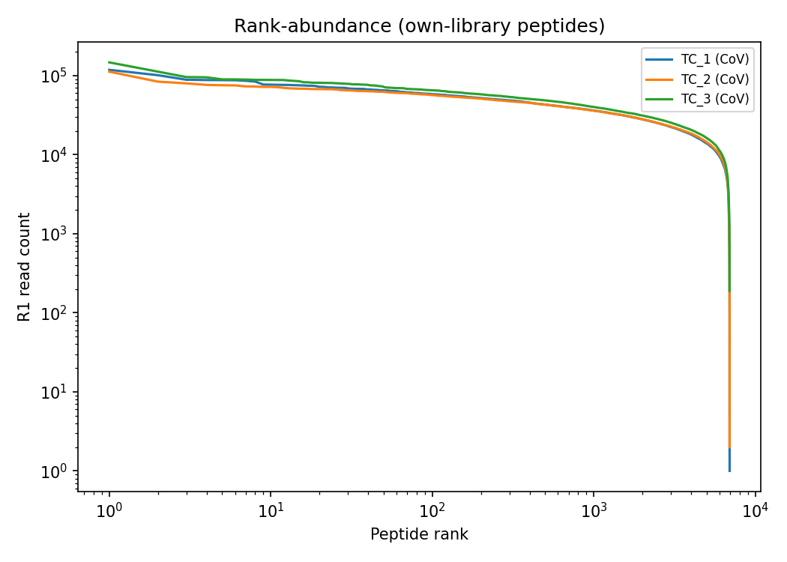
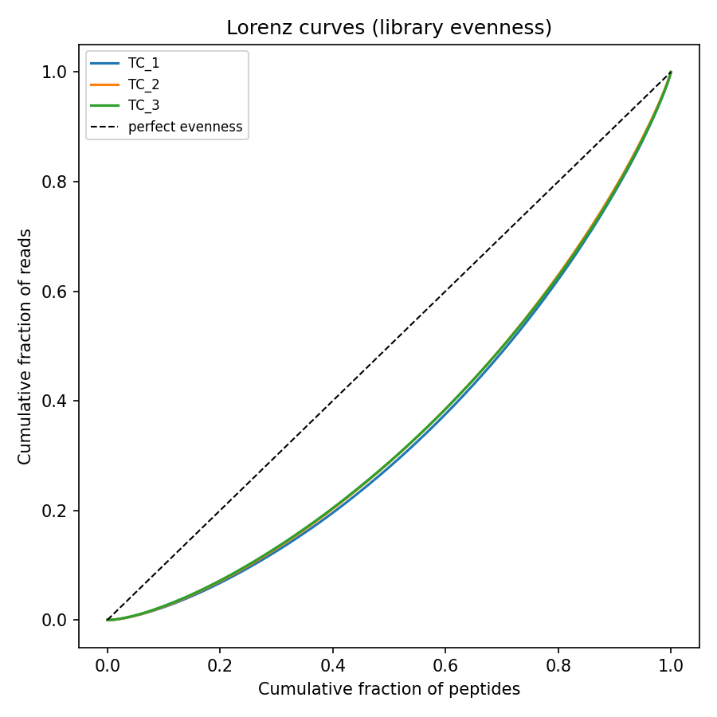
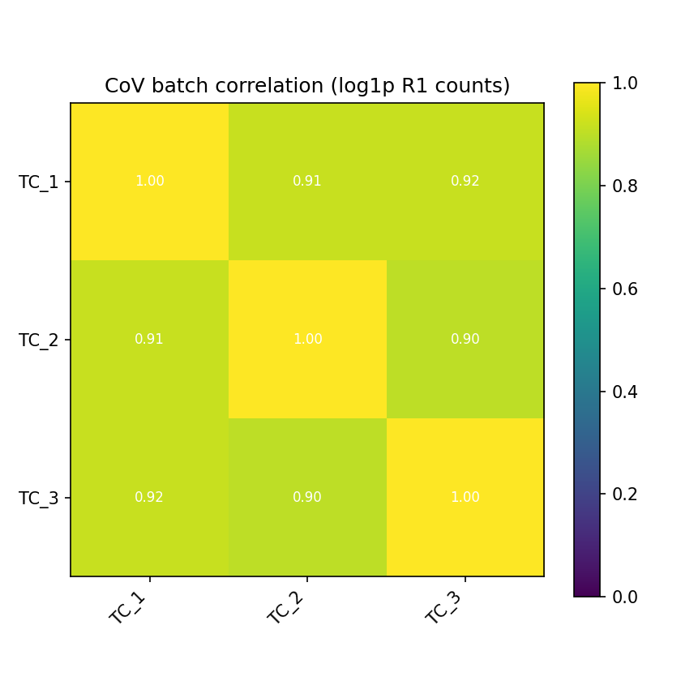

# PhIP-seq library QC summary

## Per-sample QC

| tc_id   | library   |   raw_reads_R1 |   trim_rate_R1 |   map_rate_R1 |   multimap_rate_R1 |   map_rate_R2 |   pct_mapped_to_other_library |   n_designed_peptides |   n_peptides_detected |   pct_library_covered |   n_dropouts |   median_count_detected |   gini_own_library |
|:--------|:----------|---------------:|---------------:|--------------:|-------------------:|--------------:|------------------------------:|----------------------:|----------------------:|----------------------:|-------------:|------------------------:|-------------------:|
| TC_1    | CoV       |      162736486 |          0.999 |         0.960 |              0.018 |         0.958 |                         0.000 |                  6932 |                  6932 |                 1.000 |            0 |               20204.000 |              0.314 |
| TC_2    | CoV       |      163593344 |          0.999 |         0.962 |              0.018 |         0.959 |                         0.000 |                  6932 |                  6929 |                 1.000 |            3 |               20659.000 |              0.302 |
| TC_3    | CoV       |      184619941 |          0.999 |         0.959 |              0.018 |         0.957 |                         0.000 |                  6932 |                  6931 |                 1.000 |            1 |               22898.000 |              0.302 |

## Figures

